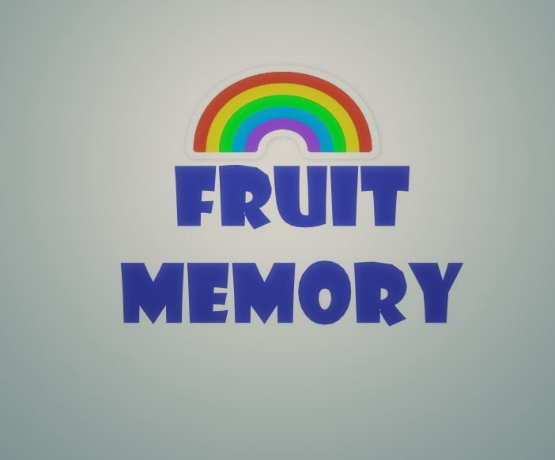

# **Fruit Memory**

Is a memory card game designed to improve short-term memory and exercise the brain. Its a game that can be enjoyed by young and old.

The game was designed using the mobile first development model with additional media queries for devices with larger screens.

<i>Why Mobile First?</i> Over half of website traffic comes from mobile devices and over 90% of internet users access the internet using a mobile phone. <a href="https://explodingtopics.com/blog/mobile-internet-traffic" target="_blank" rel="noopener">Source</a>

View the Live Game here - <a href="https://carlow78.github.io/fruit-memory/" target="_blank" rel="noopener">Fruit Memory</a>

The below screenshot shows what the game looks like in various screensizes.

# Contents

* [**User Experience UX**](<#user-experience-ux>)
    *  [User Stories](<#user-stories>)
    * [Wireframes](<#wireframes>)
    * [Design Choices](<#design-choices>)
    *  [Game Design](<#game-design>)
     *  [Why choose a memory game?](<#why-choose-a-memory-game?>)
    *  [Fonts](<#fonts>)
    *  [Color Scheme](<#color-scheme>)

* [**Game Features**](<#game-features>)
    *  [Game Canvas](<#game-canvas>)
    [Modal (Pop-ups)](<#modal-(pop-ups)>)
  

 * [**Future Features**](<#future-features>)

* [**Technologies Used**](<#technologies-used>)

* [**Testing**](<#testing>)

* [**Deployment**](<#deployment>)

* [**Credits**](<#credits>)

   * [**Content**](<#content>)
  * [**Media**](<#media>)

* [**Acknowledgements**](<#acknowledgements>)

# User Experience (UX)

## User Stories

As a user I want to ...

* be able to see instructions about how to play the game.
* be able to start a New Game.
* see all the cards turned over at the start of the game.
* a timer to start as soon as I click on the first card.
* move counter to increase each time I try to make a match.
* pair counter to increase when I find a matching pair.
* close button on the pop-up windows to close them.
* receive feedback when I find all pairs regarding my time and Moves made.
* finally, I expect the cards to appear in random order when I play a new game.

[Back to top](<#contents>)

## Wireframes

The wireframes for Fruit Memory were produced in [Balsamiq](https://balsamiq.com). As I started developing the game and looking for inspiration. The final game does differ but the idea remains the same.

 

[Back to top](<#contents>)

## Design Choices

* ### Game Design

The goal of the project was to build a fun and interactive game that can be enjoyed by the young and old. A timer is featured so they can try to improve on their quickest time. Also featured are a move counter (each time two cards are turned counts as a move) and a pair matched counter. When the pairs matched reaches the maximum of 8 the game ends and feedback is provided to the player.

* ### Why choose a memory game?

The benefits of playing memory games are many (Source Google search - memory card game benefits):

  *  Improve concentration.
  *  Improve short-memory.
  *  Enhance critical thinking.
  *  Improve attention span.
  *  Can be enjoyed by the young and old. 

* ### Font

The font chosen was 'Didact Gothic' from Google Font (https://fonts.google.com/). For the text I decided to use a Shadow effect in CSS to make the text pop out on screen.

Sans-serif is used as a fallback and as the text for modal pop-ups (How to Play and End game) with Didact Gothic used to display Move and Time taken variables to make them stand out.

 * ### Game background

The background I choose I found after numerous searches for a fruit background that wouldn't distract from the card canvas area. I eventually settled on the below image.

### Color palettes

I decided to use canva palette generator (https://www.canva.com/colors/color-palette-generator/) when looking for colors to match the above background. 

[Back to top](<#contents>)

## Game characters

The game features 8 cartoon fruit characters from Freepik.com. To make the game more appealing to the young generation.

## Deck card cover

The deck card cover was designed using Microsoft Paint 3D. It is a similar size to the above images. A rainbow was chosen to match the different colors of the fruit characters and appeal to younger players.  

[Back to top](<#contents>)

# Game Features

### Game canvas

The game features 4 x 4 squares. The 16 squares fit neatly onto smaller mobile screens. Media queries were added to increase the canvas and card sizes for larger screens.

### Game tracking

The game features 3 elements

1. Timer (activated when first card is clicked).
2. Moves counter (to track the number of times a player tries to match 2 cards).
3. Pairs matched (increases each time 2 cards are matched).

### Modal (Pop-Ups)

The game features 2 pop-up windows which both appear over the playing area.

1. How to play
2. End Game

<b>How to Play</b>

This pop-up is activated when the player clicks on the  button. Underneath the deck of   cards.

It explains the rules of the game and how to play.

<b>End Game</b>

This pop-up appears immediately after the player finds the final 8th pair of cards.

It congratulates them on the achievement and provides feedback regarding the time they have taken and the number of moves. 

[Back to top](<#contents>)

## Future Features 

* Flip card functioning
* A leaderboard for quickest time and least moves made
* Audio for different languages when cards a flipped to add language learning element to game. I.e when the apple card is flipped the spanish for apple (manzana) is played
* Ability to disable audio for above
* Text description of cards for a different language ie - manzana underneath apple.jpg
This element would work on larger screens 

[Back to top](<#contents>)

# Technologies Used
* [HTML5](https://html.spec.whatwg.org/) - provides the content and structure for the website.
* [Javascript](https://developer.mozilla.org/en-US/docs/Learn/JavaScript/First_steps/What_is_JavaScript) - scripting language and primary element of PP2.
* [CSS](https://www.w3.org/Style/CSS/Overview.en.html) - provides the styling.
* [Balsamiq](https://balsamiq.com/wireframes/) - was used to create the wireframes.
* [Visual Studio](https://code.visualstudio.com/) - was used to code locally.
* [Github Desktop](https://desktop.github.com/) - was installed and used to track changes made locally. Summary and comments were added for each commit added to Github.
* [Git for Windows](https://git-scm.com/download/win) - was installed to push changes to github made locally using Visual Studio and managed by Github Desktop.
* [Github](https://github.com/) - was used to store the project's webpages and images. After every session I pushed the updates to github for further validation and testing. 

[Back to top](<#contents>)

# Testing

Please refer to [**_here_**](TESTING.md) for more information on testing.

[Back to top](<#contents>)

# Deployment

### **To deploy the project**

The site was deployed to GitHub pages. The steps to deploy a site are as follows:

Note: Early deployment ensures bugs or issues are discovered at the earliest possible stage in the live environment. 

  1. In the GitHub repository, navigate to the **Settings** tab.
  2. Once in Settings, navigate to the **Pages** tab on the left hand side.
  3. Under **Source**, select 'Deploy from a branch'
  4. Under **Default Branch** make sure 'main' is selected as the 'branch'  and '/root' as the folder.
  5. Finally, click the **Save** button under the **Branch** section
  6. Depending on the size of the content the deployed website will finally appear at the top of Github with a link to **Visit site**.

  The live link to the Github repository can be found here - https://github.com/carlow78/fruit-memory/

### **To fork the repository on GitHub**

A Fork is a new repository for sharing and collaborating with others without impacting the original.

1. Log in to **GitHub** and locate the repository you wish to Fork.

2. On the right hand side of the page inline with the repository name is a button called **'Fork'**, click on the **Create Fork** button to create a copy of the original repository in your GitHub Account.

### **To create a local clone of this project**
The method from cloning a project from GitHub is below:

1. Under the repository’s name, click on the **code** tab.
2. In the **HTTPS** section, click on the clipboard icon to copy the given URL.
3. Click on **Open with GitHub Desktop** link
4. A warning message 'This is site is trying to open GitHubDesktop' is displayed. 
5. Click **Open** button
5. Take note of the 'local path' for future reference
6. Click on the **Clone** button

[Back to top](<#contents>)

# Credits

### Content

* The font came from [Google Fonts](https://fonts.google.com/).
* The color palette was produced with the help of [Canvas Color Palette Generator](https://www.canva.com/colors/color-palette-generator/).
* Card game was adapted by following this [YouTube tutorial](https://www.youtube.com/watch?v=wz9jeI9M9hI).
* The [Pop-up modals](https://www.w3schools.com/howto/howto_css_modals.asp)
were created with the help of W3 schools online tutorials.
* The timer feature was produced with the help of this [Stackoverflow post](https://stackoverflow.com/questions/55031097/how-do-i-start-a-timer-on-a-click#:~:text=the%20most%20basic%20way%20to,('%23button').)
* End game logic, game inspiration and idea from previous Code Institute project by [Moira Hartigan](https://moirahartigan.github.io/Portfolio-2---Alien-Memory-Game/)
* [Balsamiq](https://balsamiq.com/wireframes/) was used to create the wireframes.

### Media

* The card characters are from [Freepik](https://www.freepik.com/free-vector/cute-fruit-berry-cartoon-characters-illustrations-set-comic-stickers-with-funny-caricatures-happy-lemon-orange-mango-strawberry-personages-isolated-white_20827612.htm#query=cute%20cartoon%20fruit&position=11&from_view=keyword&track=ais&uuid=66a8faad-a13c-4bff-b040-592762bebf70)
* The deck cover was created in [Microsoft's Paint 3D](https://apps.microsoft.com/detail/9nblggh5fv99?hl=en-US&gl=IE)

[Back to top](<#contents>)

# Acknowledgements

The site was completed as a Portfolio 2 Project piece for the Full Stack Software Developer (e-Commerce) Diploma at the [Code Institute](https://codeinstitute.net/). Thank you to my mentor Precious Ijege for his input. And to our Code Institute Course Facilatator Kamil Wojciechowski for his input and for sharing Moira's excellent Project, the Slack community, the Stack Overflow community, W3 schools and all at the Code Institute for their help and support.

[Back to top](<#contents>)
