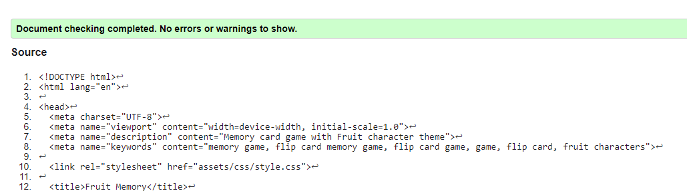
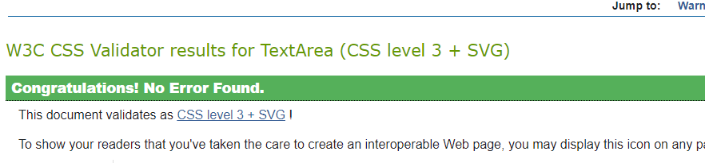
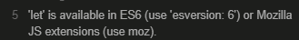
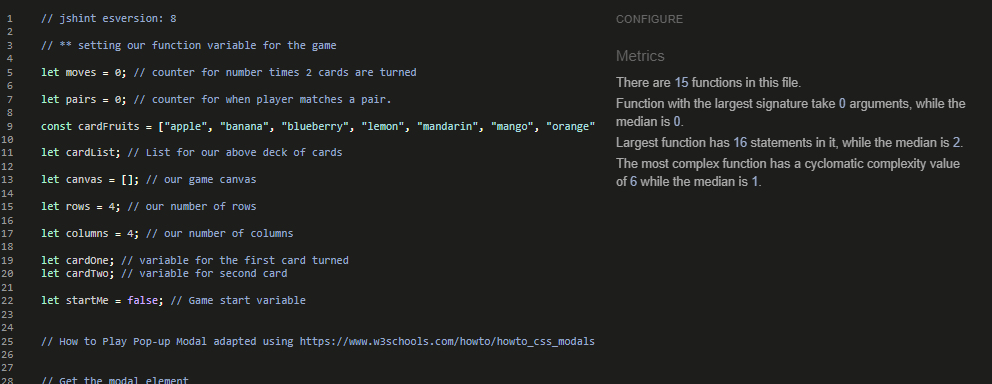
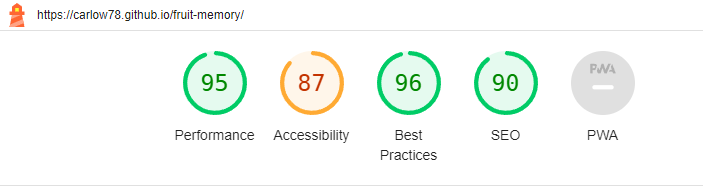
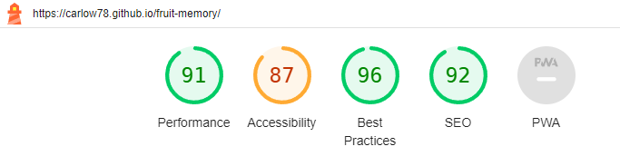

# Development

The game was developed using Mobile First development. Following the same method as Code Institute's Love Running and Love Math's Walkthrough Project examples. The game was designed using Chrome Developer Tools to work on the Samsung Galaxy Fold in Portrait mode. Media queries were then added for larger screens.

# Testing

## HTML and CSS Validation
<b>Fruit Memory</b> a Javascript Memory Card Game has been tested fully.

  All the code has been run through the [W3C html Validator](https://validator.w3.org/) and the [W3C CSS Validator](https://jigsaw.w3.org/css-validator/). Minor errors were discovered such as missing ; easily fixed on both files.

 

The HTML validator results for the index page are below:

The CSS validator results are below:

## Javascript Validation

 The JavaScript file was validated using [Jshint](https://jshint.com/). Results are below. As with the HTML and CSS files minor issues such as missing quotes were easily fixed. 

  The only issue I had to research to resolve was the below error.
Which I resolved by adding the comment: <i>// jshint esversion: 8</i> to the top of my javascript file. I found the fix here on a [Stackover flow post](https://stackoverflow.com/questions/27441803/why-does-jshint-throw-a-warning-if-i-am-using-const)

  
  

The Javascript validator results are below:

## Responsiveness Test

The responsive design tests were carried out manually with the [Google Chrome DevTools](https://developer.chrome.com/docs/devtools/).

Manual tests were also carried on the developer's own devices.

* OnePlus Nord 3 5G (2023) using Chrome - no issues
* iPad 10.5" (6th Generation) (2018) using Safari - no issues.
* Amazon Fire HD 8 (2020) using Amazon Silk - no issues.

# Chrome Developer Tools Test

|        | Samsung Galaxy Fold| iPad | iPad Pro| iPhone SE | iPad Mini | Display <1200px | Display >1200px |
|--------|---------|-----------|----------|------|----------|-----------------|-----------------|
| Render | pass    | pass      | pass     | pass | pass     | pass            | pass            |
| Images | pass    | pass      | pass     | pass | pass     | pass            | pass            |
| Links  | pass    | pass      | pass     | pass | pass     | pass            | pass            |

## Browser Compatibility

Fruit Memory was tested on the following browsers with no visible issues for the user. 

* Google Chrome
* Microsoft Edge
* Safari
* Amazon Silk
* Mozilla Firefox

 Appearance, functionality and responsiveness were consistent throughout for a range of device sizes and browsers.

## Bugs/Issues

* ### Resolved

<b>Function update issue</b> - 

Issue - Game was stopping when a pair of cards were matched.

Background and Solution - During development I came across an issue that I could not resolve myself and could not find any help for online. So I contacted Code Institute's online Tutor Support chat for my first time. I shared my workspace using Gitpod and explained my issue to the tutor Roo. He quickly identified the problem and told me how to fix it. I had my IF statement backwards. I was checking for cards that don't match first before a pair match. 

Learning outcome - The lesson I learned here is being a total newbie to programming is not to be afraid to ask for help from others with more experience after you have tried your best to resolve the issue yourself.

## Additional Testing

### Lighthouse

The site was also tested using [Google Lighthouse](https://developers.google.com/web/tools/lighthouse) in Chrome Developer Tools to test each of the pages for:

* Performance - How the page performs whilst loading.
* Accessibility - Is the site acccessible for all users and how can it be improved.
* Best Practices - Site conforms to industry best practices.
* SEO - Search engine optimisation. Is the site optimised for search engine result rankings.

  <u>Lighthouse Desktop results</u>

  <u>Lighthouse Mobile results</u>

Back to [README.md](./README.md#testing).
